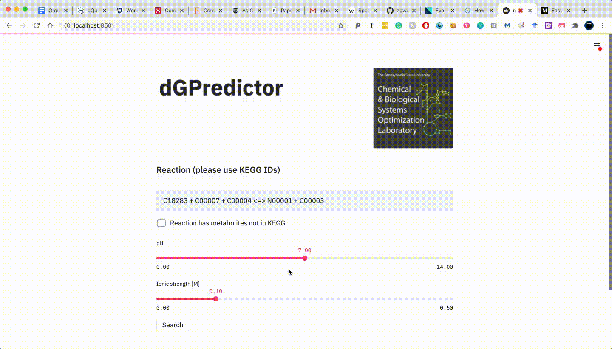

# dGPredictor

==================================
### Requirements:
1. RDkit (http://www.rdkit.org/)
2. pandas (https://pandas.pydata.org/)
3. Scikit-learn (https://scikit-learn.org/stable/)
4. Streamlit==0.55.2 (https://streamlit.io/)

==================================
### Gibbs free energy prediction use automated group decomposition method

- Step 1: decompose the metabolites based on smiles files (see function decompse_ac in decompose_groups.py or notebook )
- Step 2: create group changes vectors (i.e. reaction rules) based on group changes in metabolites of reactions (see get_rxn_rule om decompose_groups.py)
- Step 3: cross validation to check model accuracy (note that for experimental replicates, we take the median value of measurements of the same chemical reaction in
different conditions or by different researchers)
- Step 4: linear regression, Ridge Regression and Bayesian Ridge Regression in "predict.py"
- Step 5: Multiple regression models in notebook "analysis_dGPredictor.ipynb"

### Pathway design using novoStoic
- See "mini_novoStoic.py"

### Running web-interface loacally using streamlit
- run "streamlit run ./streamlit/main.py"

# demo

